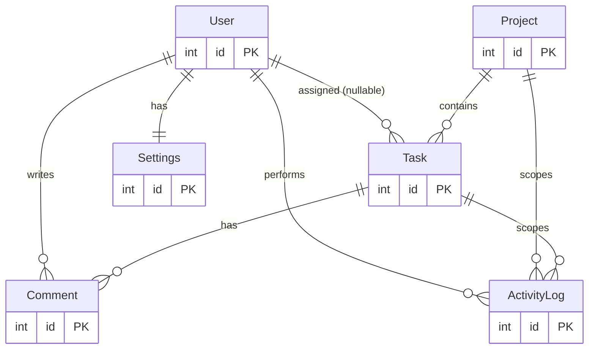

<p align="center">
  
  
  
  
  
  
</p>

<h1 align="center">✅ TaskFlow</h1>

<p align="center">
  <em>A sleek, team task-management workspace — visual Kanban boards, detailed task lists,
  drag-and-drop, activity feeds, project metrics, and collaborative discussions.</em>
</p>

<p align="center">
  <a href="#-features">Features</a> ·
  <a href="#-architecture">Architecture</a> ·
  <a href="#-quick-start">Quick Start</a> ·
  <a href="#-docker">Docker</a> ·
  <a href="#-database-schema">Database Schema</a> ·
  <a href="#-api-reference">API Reference</a> ·
  <a href="#-development">Development</a> ·
  <a href="#-security">Security</a>
</p>

---

## 🤔 The Problem

Small teams juggle work across scattered tools, and the cost adds up:

- **Status lives in people's heads** — no shared view of what's in progress vs. done.
- **Tasks and discussion are separate** — context gets lost across chat threads.
- **Progress is guessed, not measured** — no per-project completion signal.
- **No audit trail** — who moved what, when, and why is invisible.
- **Onboarding is slow** — new members can't see the shape of the work.

**TaskFlow brings those pieces together** in one fast, collaborative workspace.

---

## ✨ Features

| Capability | Without | With TaskFlow |
|---|---|---|
| Task visibility | Spreadsheets / chat | Visual **Kanban board** with 5 status columns |
| Alternate views | One rigid layout | **Kanban** *and* sortable **List view** |
| Moving work | Manual status edits | **Drag-and-drop** between columns (+ keyboard/button shifts) |
| Project progress | Guessed | **Auto-computed** % from tasks marked Done |
| Discussion | Separate from work | **Per-task comments** thread |
| History | Lost | **Activity log** on every create / move / assign / comment / delete |
| Team workload | Unknown | **Per-member** total / active / done counts |
| Dashboard | None | Metrics, upcoming deadlines, my-tasks, recent activity |
| Theming | One look | **Light / Dark / Cosmic** themes |
| Auth | None | **JWT + bcrypt** authentication (backend) |

---

## 🏗️ Architecture

TaskFlow is a two-part application: a **React SPA** and an optional **REST API** backed by SQLite.

| Layer | Technology |
|---|---|
| Frontend | React 19, TypeScript, Vite 6 |
| Styling | Tailwind CSS v4 (CSS-variable themes), `motion/react` animations, `lucide-react` icons |
| State | Single React Context (`AppProvider` / `useApp`) |
| Backend | Node.js, Express 4, TypeScript |
| ORM / DB | Prisma 6 + SQLite |
| Auth | JSON Web Tokens (`jsonwebtoken`) + `bcrypt` |
| Validation | `zod` |
| Hardening | `helmet`, `express-rate-limit`, CORS allowlist, `compression` |

**Two modes of operation:**

1. **Frontend-only (default):** all state is seeded from `src/data/mockData.ts` and persisted to the browser's `localStorage`. No server required — just `npm run dev`.
2. **Full-stack:** the `server/` package provides a real authenticated API over SQLite. (The frontend is not yet wired to it — see [Roadmap](#-roadmap).)

---

## 🔄 How It Works

**Frontend state flow**

```
mockData.ts → AppProvider (React Context) → localStorage (tf_* keys)
                     ↓
        useApp() hook → every screen & modal
```

- **Screens** are switched by a hand-rolled `navState` (`{ screen, projectId?, taskId? }`) plus a `navStack` history — there is no router.
- **Project progress** is derived (% of a project's tasks that are `Done`), recomputed on every task mutation.
- **Activity logs** are written as a side effect of nearly every action.

**Main screens**

```
LOGIN  →  DASHBOARD  →  PROJECTS  →  PROJECT_DETAIL  →  (Kanban | List)
                         TEAM
                         SETTINGS
```

**Backend request flow**

```
client → helmet → compression → CORS → json(100kb) → rate-limit → requireAuth → route → Prisma → SQLite
```

---

## 🗃️ Database Schema

The backend models the same domain as the frontend (`src/types.ts`), with integer primary keys throughout.



| Table | Purpose |
|---|---|
| `User` | Team members; holds bcrypt password hash, 2-letter avatar initials, role |
| `Project` | A workspace grouping tasks; progress is **computed on read**, not stored |
| `Task` | A unit of work with status, priority, optional assignee, due date |
| `Comment` | Discussion attached to a task |
| `ActivityLog` | Human-readable audit trail of every mutation |
| `Settings` | Per-user theme + notification preferences |

**Schema decisions**

- `status` / `priority` / `theme` are stored as **strings** (SQLite has no enums); `zod` enforces the allowed literals (`"To Do"`, `"In Progress"`, etc.) at the API boundary to match the TS unions.
- `dueDate` / `createdAt` use string dates to match the frontend's `<input type="date">` format without conversion.
- Deleting a **Task** cascades its comments; deleting a **Project** cascades its tasks; deleting a **User** sets their tasks' `assigneeId` to `null`.
- `Project.progress` is never persisted — it is recomputed as `round(done / total × 100)` on every read.

---

## 🚀 Quick Start

### Prerequisites

- **Node.js** 18+ (tested on 22)
- **npm** 10+

### Frontend (works standalone)

```bash
# from the repo root
npm install
npm run dev          # → http://localhost:3000
```

Log in with any of the seeded demo emails (any password works in frontend-only mode):
`marcus@example.com` (PM), `sarah@example.com`, `michael@example.com`, `elena@example.com`, `david@example.com`.
An unrecognized email falls back to **Marcus Vance**.

> To reset local data, clear the `tf_*` keys in your browser's `localStorage`.

### Backend (optional full-stack API)

```bash
cd server
cp .env.example .env          # then set a JWT_SECRET
npm install
npm run prisma:generate
npm run prisma:migrate        # creates server/prisma/dev.db
npm run seed                  # loads the demo dataset
npm run dev                   # → http://localhost:4000
```

All seeded users share the password from `SEED_PASSWORD` (default `password123`).

```bash
# smoke test
curl -X POST http://localhost:4000/api/auth/login \
  -H 'Content-Type: application/json' \
  -d '{"email":"marcus@example.com","password":"password123"}'
```

---

## 🐳 Docker

The whole stack runs on Docker Desktop via Compose. Host ports are chosen to **avoid conflicts** with the local dev servers (3000 / 4000): the web app is published on **8090** and the API on **4100**.

```bash
docker compose up -d --build
```

| Service | URL | Container | Host → Container |
|---|---|---|---|
| Frontend (nginx) | http://localhost:8090 | `taskflow-web` | 8090 → 80 |
| Backend API | http://localhost:4100/api | `taskflow-api` | 4100 → 4000 |

**What happens on start:** the API container applies Prisma migrations (`migrate deploy`), **seeds demo data only if the database is empty** (so restarts don't wipe data), then launches. SQLite is stored in a named volume (`taskflow-db` → `/data/dev.db`) and persists across restarts.

**Images**

- `Dockerfile` (root) — multi-stage: Node builds the Vite bundle → **nginx** serves the static files with SPA history fallback (`nginx.conf`).
- `server/Dockerfile` — Node 22 + OpenSSL (for Prisma); `server/docker-entrypoint.sh` runs migrate/seed/start.

**Useful commands**

```bash
docker compose ps              # status
docker compose logs -f         # tail logs
docker compose down            # stop (keeps the DB volume)
docker compose down -v         # stop and wipe the database
docker compose up -d --build   # rebuild after code changes
```

> The API container runs with `NODE_ENV=production`, so it requires a strong `JWT_SECRET` (set in `docker-compose.yml` — **change it for any real deployment**) and a `CLIENT_ORIGIN` allowlist (defaults to `http://localhost:8090`).

---

## ⚙️ Configuration

### Backend environment (`server/.env`)

```env
DATABASE_URL="file:./dev.db"           # Prisma SQLite location
JWT_SECRET="<strong-random-string>"    # REQUIRED; >= 32 chars in production
JWT_EXPIRES_IN="7d"                    # token lifetime
NODE_ENV="development"                 # "production" enforces strict secret validation
CLIENT_ORIGIN="http://localhost:3000"  # CORS allowlist (comma-separated)
PORT=4000
SEED_PASSWORD="password123"            # password applied to all seeded users
```

### Secret handling

The server **refuses to start in production** if `JWT_SECRET` is missing, shorter than 32 chars, or left at the dev default. Generate one with:

```bash
openssl rand -base64 48
```

### Frontend environment (AI Studio)

The root `.env.local` may hold `GEMINI_API_KEY` / `APP_URL` (injected by Google AI Studio). The current app makes no live Gemini calls — it is fully client-side.

---

## 📡 API Reference

Base path `/api`. All routes except `auth/login` and `auth/register` require an `Authorization: Bearer <jwt>` header.

### Auth

| Method | Endpoint | Description |
|---|---|---|
| `POST` | `/auth/register` | Create an account → `{ token, user }` |
| `POST` | `/auth/login` | Verify credentials (bcrypt) → `{ token, user }` |
| `GET` | `/auth/me` | Current user from token |
| `POST` | `/auth/logout` | Records a logout activity (stateless JWT) |

### Projects

| Method | Endpoint | Description |
|---|---|---|
| `GET` | `/projects` | All projects with computed `progress` + task counts |
| `GET` | `/projects/:id` | One project + its tasks |
| `POST` | `/projects` | Create a project |
| `PATCH` | `/projects/:id` | Update a project |
| `DELETE` | `/projects/:id` | Delete (cascades tasks/comments) |

### Tasks

| Method | Endpoint | Description |
|---|---|---|
| `GET` | `/tasks?projectId=&status=&priority=&assigneeId=&q=` | Filter/search tasks |
| `GET` | `/tasks/:id` | Task + comments + activity |
| `POST` | `/tasks` | Create a task (writes activity) |
| `PATCH` | `/tasks/:id` | Update (auto-generates the activity sentence) |
| `DELETE` | `/tasks/:id` | Delete (cascades comments) |

### Comments / Team / Settings / Feeds

| Method | Endpoint | Description |
|---|---|---|
| `GET` | `/tasks/:taskId/comments` | Comments for a task |
| `POST` | `/tasks/:taskId/comments` | Add a comment |
| `DELETE` | `/comments/:id` | Delete a comment |
| `GET` | `/users` | Team members + per-user task counts |
| `GET` | `/users/:id` | One user |
| `GET` | `/settings` | Current user's settings |
| `PATCH` | `/settings` | Update profile / theme / notifications |
| `GET` | `/activity?limit=` | Recent activity feed |
| `GET` | `/dashboard` | Aggregate payload backing the Dashboard |
| `GET` | `/health` | Liveness check |

> All user objects are serialized **without** the password hash.

---

## 🧑‍💻 Development

### Project structure

```text
TaskFlow-x/
├── index.html                 # Vite entry
├── Dockerfile                 # frontend image (Vite build → nginx)
├── nginx.conf                 # SPA history fallback for nginx
├── docker-compose.yml         # orchestrates web (8090) + api (4100)
├── src/                       # React frontend
│   ├── App.tsx                # screen routing + modal orchestration
│   ├── main.tsx
│   ├── types.ts               # domain model (source of truth for shapes)
│   ├── index.css              # Tailwind v4 + theme CSS variables
│   ├── context/
│   │   └── AppContext.tsx     # all state, actions, localStorage persistence
│   ├── data/
│   │   └── mockData.ts        # seed dataset (users/projects/tasks/comments/logs)
│   └── components/
│       ├── Login.tsx          Dashboard.tsx     Projects.tsx
│       ├── ProjectDetail.tsx  KanbanBoard.tsx   ListView.tsx
│       ├── TaskFormModal.tsx  TaskDetailModal.tsx
│       ├── TeamMembers.tsx    Settings.tsx
│       ├── Navigation.tsx     Preloader.tsx
└── server/                    # Express + Prisma backend
    ├── Dockerfile             # API image (Node + Prisma)
    ├── docker-entrypoint.sh   # migrate → seed-if-empty → start
    ├── prisma/
    │   ├── schema.prisma      # data model
    │   └── seed.ts            # ports mockData.ts into SQLite
    └── src/
        ├── index.ts           # app bootstrap + middleware chain
        ├── lib/               # prisma client, jwt, zod schemas, serializers
        ├── middleware/        # requireAuth, validate, rateLimit
        ├── services/          # activity logging, progress computation
        └── routes/            # auth, projects, tasks, comments, users, settings, activity, dashboard
```

### Frontend scripts (root)

| Command | Purpose |
|---|---|
| `npm run dev` | Start Vite dev server on port 3000 |
| `npm run build` | Production build |
| `npm run preview` | Preview the production build |
| `npm run lint` | Type-check (`tsc --noEmit`) |

### Backend scripts (`server/`)

| Command | Purpose |
|---|---|
| `npm run dev` | Start API with hot reload (tsx watch) |
| `npm run build` | Compile to `dist/` |
| `npm run start` | Run the compiled server |
| `npm run lint` | Type-check (`tsc --noEmit`) |
| `npm run prisma:generate` | Generate the Prisma client |
| `npm run prisma:migrate` | Run dev migrations |
| `npm run prisma:reset` | Drop & recreate the database |
| `npm run seed` | Load the demo dataset |

---

## ⚡ Performance

The UI is tuned to feel instant:

- **No artificial delays** — navigation, login, and the dashboard render immediately (previous simulated `setTimeout` loaders were removed).
- **Fast crossfade** screen transitions (~120ms, non-blocking) instead of a serialized exit/enter.
- **Memoized Context** value + `useCallback` actions so a single task change doesn't re-render every screen.
- **`useMemo`'d derived data** — dashboard metrics, Kanban column grouping, list sorting, project/team aggregates are computed once per change in a single pass.
- **gzip compression** on API responses.

---

## 🔒 Security

The backend is hardened (the React frontend escapes output by default):

- **`helmet`** — CSP, HSTS, `nosniff`, frameguard; `X-Powered-By` removed.
- **CORS allowlist** — only origins in `CLIENT_ORIGIN` are permitted.
- **Rate limiting** — 20 auth attempts / 15 min (brute-force/signup-abuse), 300 req/min global backstop.
- **JWT secret guard** — refuses to boot in production with a missing/weak/default secret.
- **Body-size limit** (`100kb`) and **bounded input** via `zod` (max lengths) to blunt payload DoS.
- **bcrypt** password hashing; passwords never returned in responses.
- **Generic error responses** — internal details are logged server-side, not leaked to clients.

> When wiring the frontend to the API, prefer an **httpOnly cookie** over `localStorage` for the JWT (XSS-resistant).

---

## 🔍 Troubleshooting

| Symptom | Likely cause | Fix |
|---|---|---|
| `vite: command not found` | Dependencies not installed | Run `npm install` |
| App shows stale data | Old `tf_*` values in `localStorage` | Clear them in DevTools → Application |
| Server won't start in prod | Weak/missing `JWT_SECRET` | Set a 32+ char secret (`openssl rand -base64 48`) |
| `401` on every API call | Missing/expired token | Re-login; send `Authorization: Bearer <jwt>` |
| CORS error in browser | Origin not in allowlist | Add it to `CLIENT_ORIGIN` in `server/.env` |
| `429 Too Many Requests` | Rate limiter tripped | Wait out the window (auth: 15 min) |

---

## 🗺️ Roadmap

- Wire the React frontend to the backend API (async login, token storage, Vite `/api` proxy) — currently the SPA runs on `localStorage`.
- Per-resource authorization (ownership) if multi-tenant isolation is needed.
- Real-time updates (websockets) for collaborative boards.

---

## 📄 License

Apache-2.0 (per source file headers). Internal project — FITM, KMUTNB.
